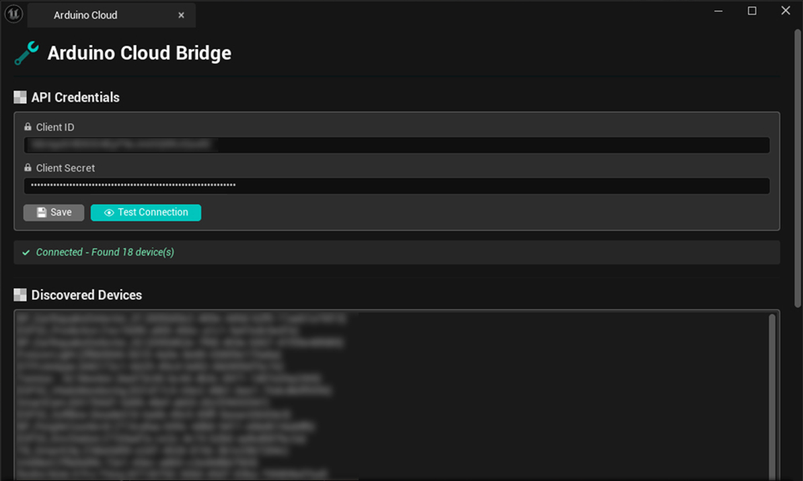
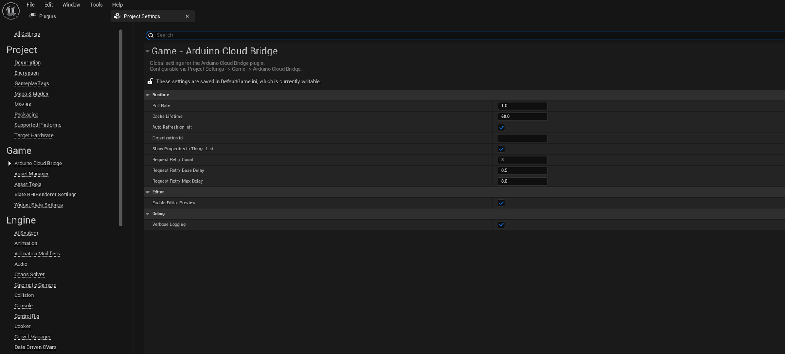
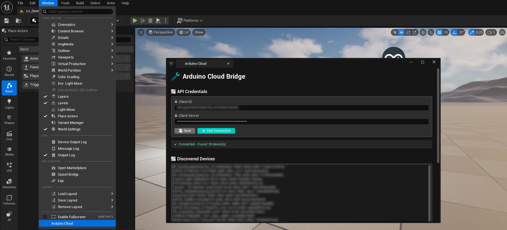
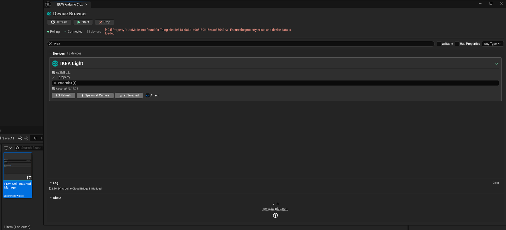
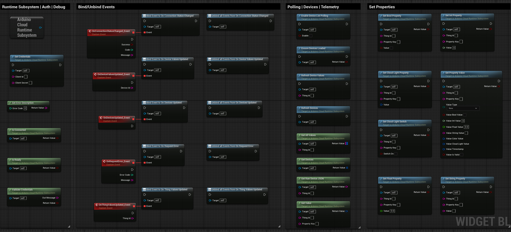
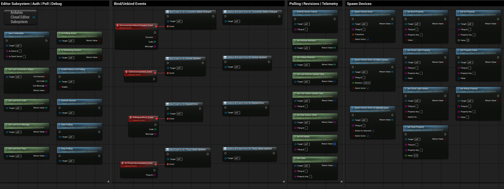
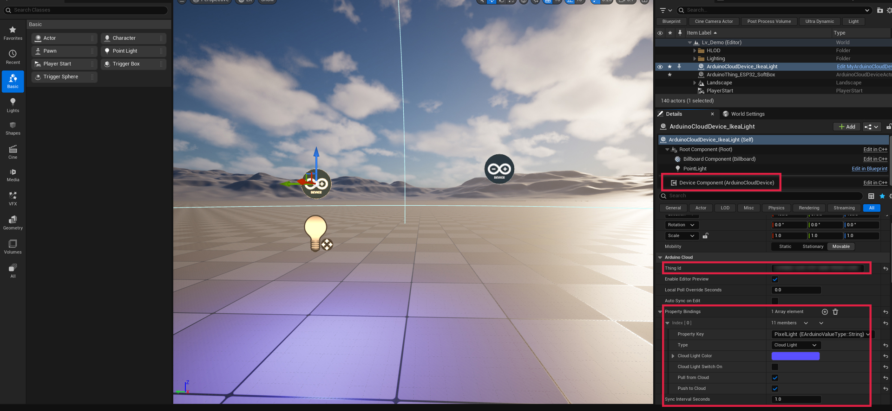
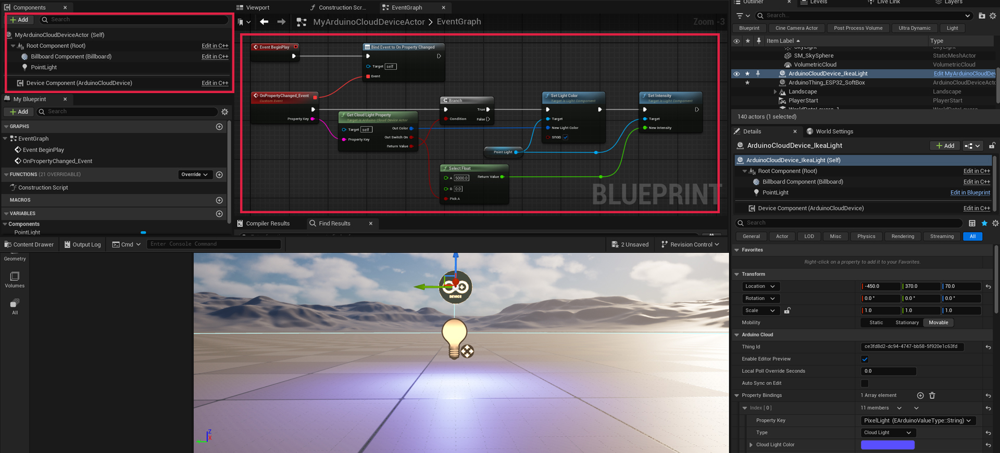

# Twinise | Arduino Cloud Bridge - User Guide

**Complete guide to integrating Arduino Cloud with Unreal Engine**


*Connect your Unreal Engine projects to Arduino IoT Cloud in minutes*


---

## Table of Contents

1. [Introduction](#introduction)
2. [Installation](#installation)
3. [Quick Start](#quick-start)
4. [Configuration](#configuration)
   - [Project Settings](#project-settings)
   - [Arduino Cloud Credentials](#arduino-cloud-credentials)
5. [Editor Tools](#editor-tools)
   - [Arduino Cloud Menu](#arduino-cloud-menu)
   - [Device Browser (EUW)](#device-browser-euw)
6. [Blueprint API](#blueprint-api)
   - [Runtime Subsystem](#runtime-subsystem-nodes)
   - [Editor Subsystem](#editor-subsystem-nodes)
7. [Components & Actors](#components--actors)
   - [Device Component](#device-component)
   - [Device Actor](#device-actor)
8. [Common Workflows](#common-workflows)
9. [Troubleshooting](#troubleshooting)

---

## Introduction

**Arduino Cloud Bridge** is a production-ready Unreal Engine plugin that enables seamless bidirectional communication with Arduino IoT Cloud. Built with a Blueprint-first approach, it requires zero C++ knowledge while providing full access to Arduino Cloud devices, properties, and real-time data.

### Key Features

| Feature | Description |
|---------|-------------|
| 🔐 **OAuth2 Authentication** | Automatic token management with refresh |
| 📡 **Real-Time Polling** | Configurable automatic data sync |
| 📘 **Blueprint-First** | Full functionality without C++ |
| 🔄 **Bidirectional Sync** | Read AND write cloud properties |
| 📱 **Multi-Platform** | Win64, Mac, Linux, Android, iOS |
| 🎮 **Runtime + Editor** | Works in-game and in-editor |

---

## Installation

### From FAB Marketplace

1. Open **Epic Games Launcher**
2. Go to **FAB Marketplace**
3. Search for "Arduino Cloud Bridge"
4. Click **Install to Engine**
5. Enable in your project's Plugins menu

### Manual Installation

1. Download the plugin archive
2. Extract to `YourProject/Plugins/ArduinoCloudBridge/`
3. Regenerate project files
4. Open project and enable plugin

---

## Quick Start

### Step 1: Get Arduino Cloud API Credentials

1. Go to [Arduino Cloud API Keys](https://cloud.arduino.cc/home/api-keys)
2. Click **Create API Key**
3. Copy your **Client ID** and **Client Secret**

> ⚠️ **Keep your credentials secure!** Never commit them to version control.

### Step 2: Configure the Plugin



1. In Unreal Editor, go to **Window → Arduino Cloud**
2. Enter your **Client ID** and **Client Secret**
3. Click **Save Credentials**
4. Click **Test Connection & List Devices**
5. You should see your devices listed!

### Step 3: Use in Blueprints

```
Event BeginPlay
  → Get Game Instance
  → Get Subsystem (ArduinoCloudRuntimeSubsystem)
  → Refresh Devices
```

That's it! You're connected to Arduino Cloud.

---

## Configuration

### Project Settings

Access via **Edit → Project Settings → Plugins → Arduino Cloud Bridge**



| Setting | Description | Default |
|---------|-------------|---------|
| **Poll Interval Seconds** | How often to fetch data from cloud | 5.0 |
| **Enable Auto Reconnect** | Automatically reconnect on disconnect | true |
| **Max Retry Attempts** | Number of retries on failure | 3 |
| **Retry Delay Seconds** | Delay between retry attempts | 2.0 |
| **Enable Verbose Logging** | Log detailed API interactions | false |
| **Organization Id** | For Arduino organization accounts | (empty) |

### Arduino Cloud Credentials

Credentials are stored securely in the Editor's per-project user settings (not shipped with packaged games).

**Setting credentials via Editor:**
1. **Window → Arduino Cloud** → Enter credentials → Save

**Setting credentials at runtime (for packaged games):**
```
Get Subsystem (ArduinoCloudRuntimeSubsystem)
  → Set Credentials (ClientId, ClientSecret)
```

---

## Editor Tools

### Arduino Cloud Menu

Access via **Window → Arduino Cloud**



The Arduino Cloud window provides:

| Section | Description |
|---------|-------------|
| **Credentials** | Enter and save Client ID / Secret |
| **Connection** | Test connection and view status |
| **Devices** | View all connected Things |
| **Actions** | Refresh devices, start/stop polling |

### Device Browser (EUW)

The Editor Utility Widget provides a visual interface for browsing and managing Arduino Cloud devices directly in the editor.



**Features:**

| Panel | Description |
|-------|-------------|
| **Header** | Connection status, device count, polling controls |
| **Filters** | Search, filter by property type, writable only |
| **Device Cards** | Expandable cards showing device properties |
| **Log Panel** | Activity log with timestamps |
| **About Panel** | Plugin version and links |

**Device Card Details:**
- Thing name and ID
- Online/Offline status
- Expandable property list
- Property types and values
- Spawn Device Actor button

---

## Blueprint API

### Runtime Subsystem Nodes

Access via: `Get Game Instance → Get Subsystem (ArduinoCloudRuntimeSubsystem)`



#### Reading Data

| Node | Description |
|------|-------------|
| `Get Devices` | Get array of all cached Things |
| `Get Value` | Get specific property value |
| `Get All Values` | Get all properties for a Thing |
| `Is Ready` | Check if subsystem initialized |
| `Is Connected` | Check cloud connection status |

#### Writing Data

| Node | Description |
|------|-------------|
| `Set Bool Property` | Write boolean value |
| `Set Int Property` | Write integer value |
| `Set Float Property` | Write float value |
| `Set String Property` | Write string value |
| `Set Cloud Light Property` | Write HSB + switch |

#### Control

| Node | Description |
|------|-------------|
| `Refresh Devices` | Fetch device list from cloud |
| `Refresh Device Values` | Fetch properties for specific Thing |
| `Enable Device List Polling` | Start/stop automatic polling |
| `Set Credentials` | Set API credentials at runtime |

#### Events

| Event | When It Fires |
|-------|---------------|
| `On Devices Updated` | Device list refreshed |
| `On Thing Values Updated` | Property values refreshed |
| `On Request Error` | API error occurred |
| `On Connection Status Changed` | Connect/disconnect |

### Editor Subsystem Nodes

Access via: `Get Editor Subsystem (ArduinoCloudEditorSubsystem)`

> ⚠️ **Editor Only!** These nodes only work in Editor Utility Widgets and Editor Blueprints.



| Node | Description |
|------|-------------|
| `Save Credentials` | Save Client ID / Secret |
| `Refresh Devices` | Fetch devices (no PIE needed) |
| `Get Devices` | Get cached device list |
| `Start Polling` / `Stop Polling` | Control auto-refresh |
| `Spawn Device Actor` | Spawn device actor in level |
| `Spawn Device Actor At Editor Camera` | Spawn at viewport |

---

## Components & Actors

### Device Component

`UArduinoCloudDeviceComponent` - Add to any actor to link it to an Arduino Cloud Thing.



#### Configuration

| Property | Description |
|----------|-------------|
| **Thing Id** | The Arduino Cloud Thing to link |
| **Enable Editor Preview** | Update values without PIE |
| **Local Poll Override** | Override global poll rate |
| **Auto Sync On Edit** | Push changes automatically |

#### Reading Values

```
Get Component → Get Float Property ("temperature")
  → Use the float value
```

#### Writing Values (Queue-Based)

```
Get Component → Set Float Property ("brightness", 0.75)
Get Component → Sync To Cloud
  → Changes are pushed
```

> 💡 **Queue System:** Changes are queued locally until you call `Sync To Cloud`. This allows batching multiple property updates into a single API call.

### Device Actor

`AArduinoCloudDeviceActor` - Pre-built actor with billboard visualization and property binding system.



#### Visual Representation

The Device Actor displays a billboard icon in the editor for easy placement. Configure visibility:

| Property | Description |
|----------|-------------|
| **Billboard Screen Size** | Size in editor viewport |
| **Show Billboard In Game** | Visibility in packaged game |

#### Property Bindings

Map cloud properties to local values using the Property Bindings array:

| Field | Description |
|-------|-------------|
| **Property Key** | Cloud variable name |
| **Type** | Bool, Int, Float, String, Color, CloudLight |
| **Pull From Cloud** | Receive cloud updates |
| **Push To Cloud** | Send local changes |
| **Value Fields** | Local value storage |

**Example Binding:**
```
Property Key: "temperature"
Type: Float
Pull From Cloud: ✓
Push To Cloud: ✗
Float Value: (auto-updated from cloud)
```

#### CloudLight Support

For Arduino CloudLight variables:

| Property | Description |
|----------|-------------|
| **Cloud Light Color** | Color picker (HSB) |
| **Cloud Light Switch On** | On/Off toggle |

---

## Common Workflows

### Reading Sensor Data

```
Event BeginPlay
  → Get Game Instance → Get Subsystem
  → Bind Event to On Thing Values Updated
  → Refresh Devices

On Thing Values Updated (ThingId)
  → Get Value (ThingId, "temperature")
  → Break ArduinoValue → FloatValue
  → Update UI / Game Logic
```

### Controlling an LED

```
On Button Pressed
  → Get Game Instance → Get Subsystem
  → Set Bool Property (ThingId, "led", true)
```

### Monitoring Connection Status

```
Event BeginPlay
  → Bind Event to On Connection Status Changed

On Connection Status Changed (bSuccess, Code, Message)
  → Branch (bSuccess)
    True → Show "Connected" UI
    False → Show Error Message
```

### Editor-Time Device Preview

1. Add `ArduinoCloudDeviceComponent` to actor
2. Set **Thing Id**
3. Enable **Enable Editor Preview**
4. Property values update in editor without PIE!

---

## Troubleshooting

### Common Issues

| Problem | Solution |
|---------|----------|
| "Not Connected" | Check credentials in Window → Arduino Cloud |
| No devices shown | Click "Test Connection & List Devices" |
| Values not updating | Check polling is enabled, verify Thing ID |
| 401 Unauthorized | Credentials expired, re-enter and save |
| 403 Forbidden | Check Organization ID if using org account |

### Error Codes

| Code | Meaning |
|------|---------|
| 0 | Success |
| 401 | Invalid credentials |
| 403 | Access forbidden (check org ID) |
| 404 | Thing/Property not found |
| 429 | Rate limited (too many requests) |
| 500+ | Arduino Cloud server error |

### Debug Logging

Enable verbose logging in Project Settings:
```
Project Settings → Plugins → Arduino Cloud Bridge → Enable Verbose Logging
```

View logs in **Output Log** with filter: `LogArduinoCloud`

---

## Support

- **Documentation:** [GitHub Wiki](https://github.com/lAvArt/FAB-Plugins-Hub/wiki)
- **Issues:** [GitHub Issues](https://github.com/lAvArt/FAB-Plugins-Hub/issues)
- **Website:** [www.twinise.com](https://www.twinise.com)

---

*© 2026 Twinise. Arduino is a trademark of Arduino AG.*
