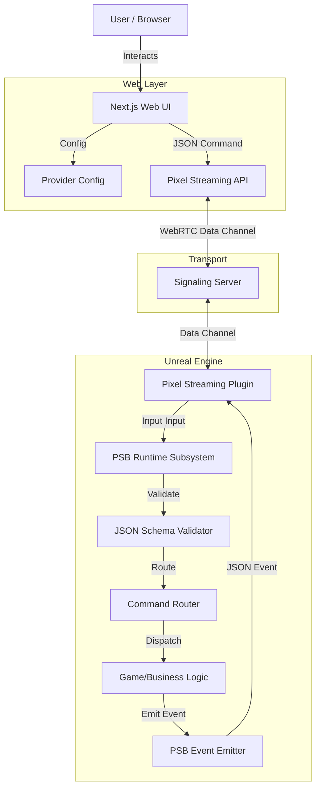

# Architecture

## High-Level Data Flow



## Core Components

### 1. Web UI (Reference)
- **Role**: Demonstrates how to connect, configure providers, and send commands.
- **Tech**: Next.js.
- **Key Files**: `psbClient.ts` (wraps the Pixel Stream emit functions).

### 2. PSB Runtime Subsystem (Unreal)
- **Role**: The central hub for the bridge. Lives on `GameInstance`.
- **Responsibilities**:
    - Listening to Pixel Streaming input.
    - Parsing inbound JSON.
    - Validating against `message-contract.md`.
    - Routing commands to registered delegates.
    - Emitting events via `SendEnvelopeJson` (uses `OnEmitResponse` if bound, else C++ transport).

### 3. Command Router
- **Role**: Maps string names (e.g., "spawn_object") to C++ Delegates or Blueprint Event Dispatchers.
- **Constraint**: strictly string-to-delegate. No hardcoded logic.
```
