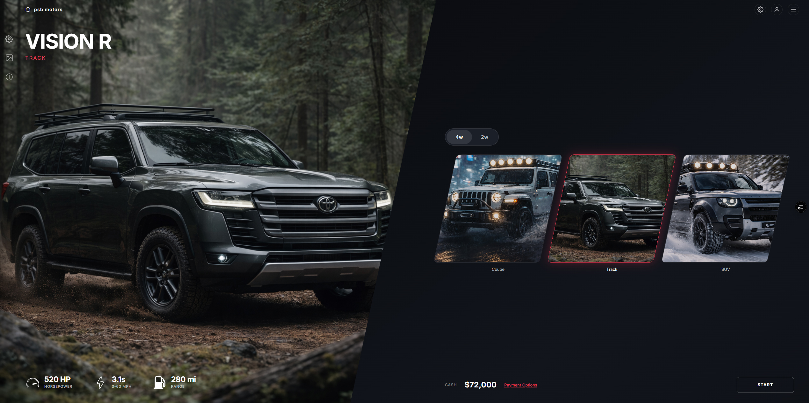
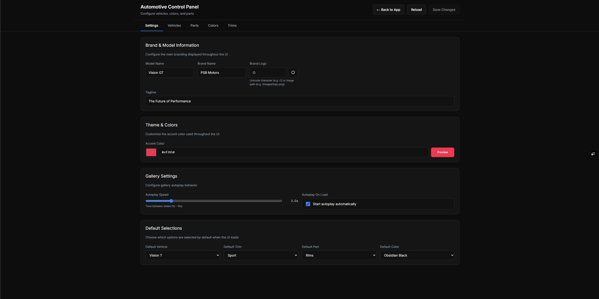
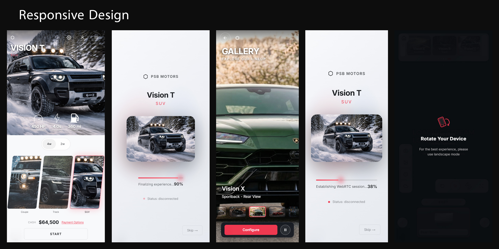

# PSB Automotive UI Template

Production-ready automotive configurator UI for Pixel Streaming experiences.




---

## Live Demo

UI-only demo (no live Unreal stream):

**[automotive.lavartstudio.com](https://automotive.lavartstudio.com)**

For full Unreal integration, connect this template to your Pixel Streaming pipeline (or the Pixel Streaming Bridge plugin).

---

## Latest Updates (February 10, 2026)

- Added Animate quick action in the viewer toolbar with `psb.animation.trigger` command mapping.
- Added reset-button visual flash feedback in quick actions.
- Trim selector now starts collapsed by default in the viewer.
- Added portrait mobile rotate overlay prompt in the viewer.
- Improved gallery behavior and mobile UX:
  - Auto-centers active thumbnail in the strip.
  - Refined bottom action layout.
  - Improved fullscreen mobile and lightbox presentation.
- Added `resources/` screenshot pack and linked it in docs.

---

## Overview

The Automotive template ships a complete multi-page flow:

- Home page (`/`): vehicle selection, drive-type filter, hero experience.
- Loading page (`/loading`): PSB connection progress and staged loading UI.
- Viewer page (`/viewer`): full configurator and PSB command emission.
- Gallery page (`/gallery`): immersive slideshow + lightbox showroom.
- Control panel (`/control-panel`): local config editor with save flow.

### Included

- Next.js App Router frontend (`app/`)
- UI components and theme contexts
- Config-driven vehicle/parts/colors/trims model
- PSB command mapping (`config.ts`)
- Local control panel API routes

### Not Included

- Unreal project/content
- Signalling server deployment
- PSB plugin binaries

---

## Key Features

### Configurator and Commands

- Vehicle, part, color/model, trim, scene, weather, time controls.
- Camera views and reset action.
- Mouse cursor toggle command (`psb.system.set_mouse_cursor`).
- Animate toggle command (`psb.animation.trigger`).

### Responsive UX

- Home and gallery layouts tuned for desktop/tablet/mobile.
- Portrait-device rotate prompt on viewer for touch devices.
- Gallery supports keyboard, touch swipe (lightbox), autoplay, and direct thumbnail navigation.

### Control Panel

- Edit major config sections without manual TS editing.
- Save writes directly to `config.ts`.
- Automatic backup file written as `config.ts.bak` on save.
- Optional in production via `PSB_ENABLE_CONTROL_PANEL=true`.



### Screenshot Reference Pack

High-res UI references are included in `resources/`.



---

## Quick Start

### Requirements

- Node.js 18+
- pnpm (recommended) or npm

### Install and Run

```bash
cd psb-ui/templates/automotive
pnpm install
pnpm dev
```

Open `http://localhost:3000`.

---

## Configuration

All primary configuration is in `config.ts`.

- Branding: `vehicleConfig`
- Vehicle catalog: `vehicles`, `defaultVehicleId`
- Trims: `trimLevels`, `defaultTrimId`
- Parts and options: `configurableParts`, `vehicleParts`, `vehiclePartModelOptions`, `partModelOptions`
- UI toggles: `uiVisibility`
- Theme settings: `themeConfig`
- Gallery autoplay: `galleryConfig`
- Connection and reconnect policy: `connectionConfig`
- PSB command names: `psbCommands`

See full walkthrough in `USER_GUIDE.md`.

---

## Routes

- `/` home vehicle selector
- `/loading?vehicle=<vehicleId>` loading/connection handoff
- `/viewer?vehicle=<vehicleId>` configurator
- `/gallery` showroom
- `/control-panel` local config editor
- `/api/control-panel/config` read/write config API
- `/api/control-panel/images` image list/upload/delete API

---

## Environment Variables

Use `.env.local` (see `.env.example`).

```env
NEXT_PUBLIC_PLAYER_URL=https://your-signalling-server.com/psb-player.html?AutoConnect=true&AutoPlayVideo=true&StartVideoMuted=true
```

Notes:

- Viewer uses `connectionConfig.playerUrl` (which defaults from `NEXT_PUBLIC_PLAYER_URL`).
- Loading page currently reads `NEXT_PUBLIC_PSB_URL` and falls back to `/psb-player.html`.

---

## Deployment Notes

This is a Next.js app (not a static HTML export by default).

- Production build:

```bash
pnpm build
pnpm start
```

- For Vercel/Node hosting, deploy as a Next.js server app.
- If you expose control panel in production, set `PSB_ENABLE_CONTROL_PANEL=true`.

---

## File Layout

```text
automotive/
  app/
    page.tsx
    loading/page.tsx
    viewer/page.tsx
    gallery/page.tsx
    control-panel/page.tsx
    api/control-panel/config/route.ts
    api/control-panel/images/route.ts
  components/
    AutomotiveUI.tsx
    AutomotiveViewerPage.tsx
    Icon.tsx
  context/
    ThemeContext.tsx
    PreferencesContext.tsx
  config.ts
  resources/
  public/
    images/
    icons/
```

---

## Docs and Support

- User guide: `USER_GUIDE.md`
- Documentation hub: [github.com/LavArtStudio/FAB-Plugins-Hub](https://github.com/LavArtStudio/FAB-Plugins-Hub)
- Live demo: [automotive.lavartstudio.com](https://automotive.lavartstudio.com)

Created by [lAvArt Studio](https://lavartstudio.com)
