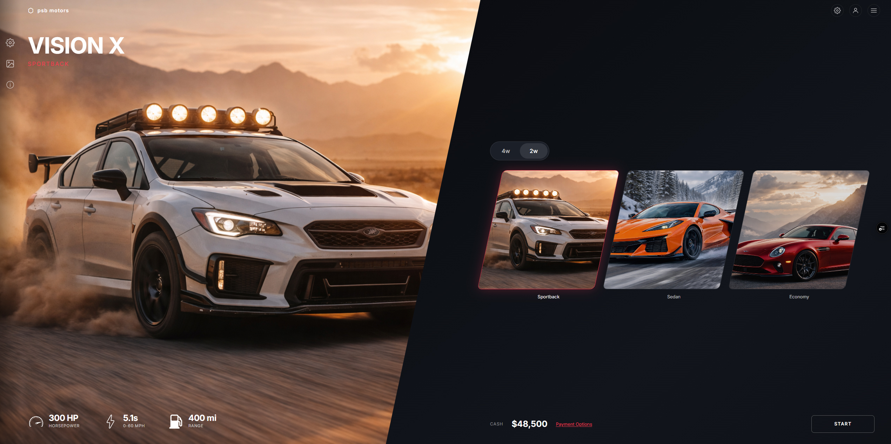
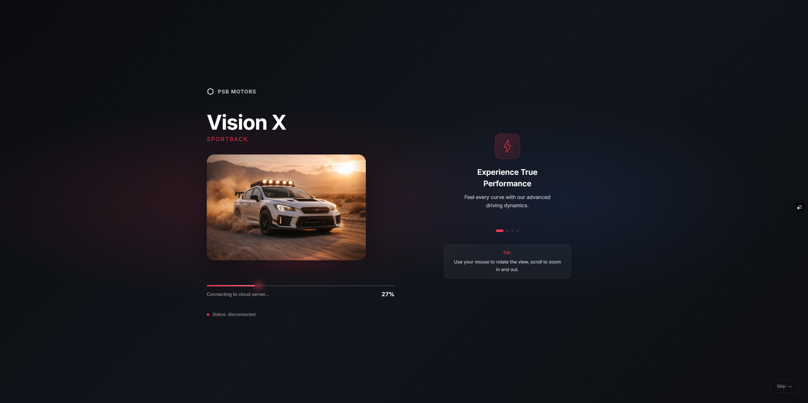
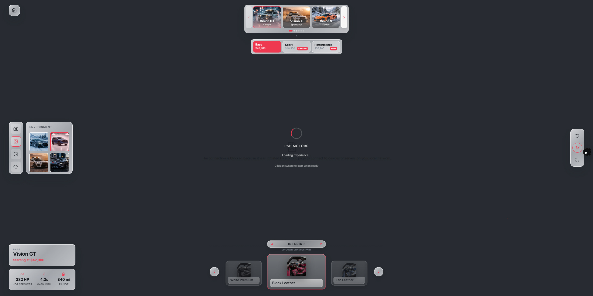
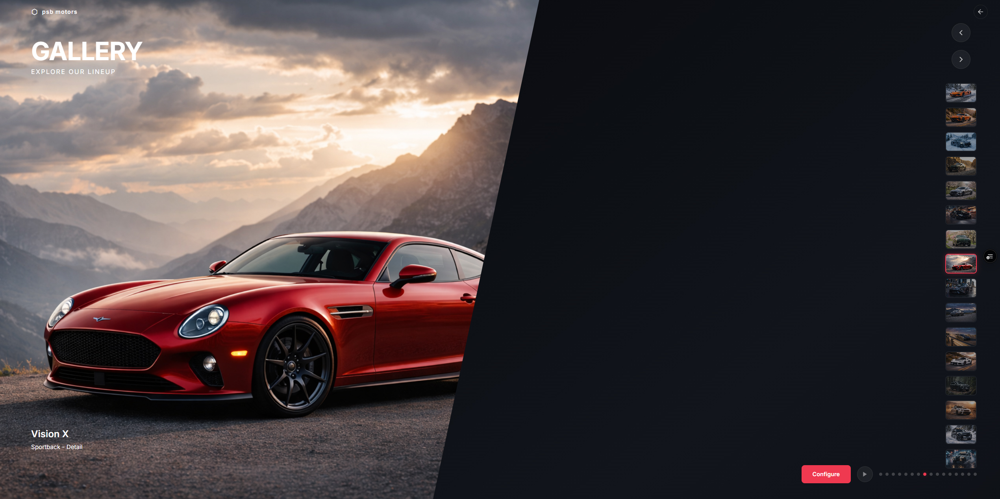
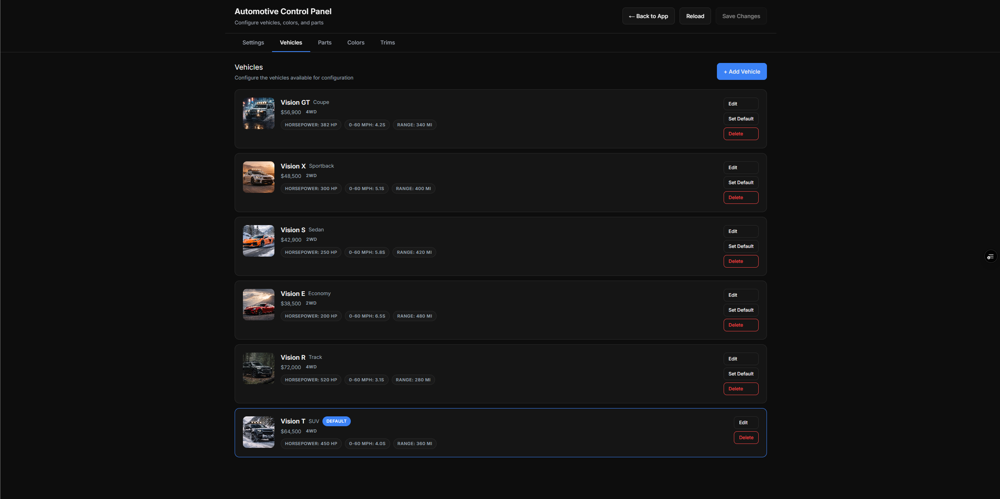

# PSB Automotive UI Template - User Guide

Comprehensive setup, customization, and integration guide for the Automotive template.

---

## Contents

1. Getting Started
2. Current Update Summary
3. App Structure and Routes
4. Page-by-Page Guide
5. Configuration Reference (`config.ts`)
6. Pixel Streaming Command Integration
7. Control Panel Guide
8. Assets and Screenshot Resources
9. Responsive Behavior Notes
10. Deployment
11. Troubleshooting
12. Support

---

## Getting Started

### Requirements

- Node.js 18+
- pnpm (recommended) or npm
- Modern browser with WebRTC support

### Install

```bash
cd psb-ui/templates/automotive
pnpm install
pnpm dev
```

Open `http://localhost:3000`.

### Environment Variables

Copy `.env.example` to `.env.local` and update URLs.

```env
NEXT_PUBLIC_PLAYER_URL=https://your-signalling-server.com/psb-player.html?AutoConnect=true&AutoPlayVideo=true&StartVideoMuted=true
```

Connection variable notes:

- Viewer path uses `connectionConfig.playerUrl` from `config.ts` (default reads `NEXT_PUBLIC_PLAYER_URL`).
- Loading page currently reads `NEXT_PUBLIC_PSB_URL` and falls back to `/psb-player.html`.

---

## Current Update Summary

These updates are included as of February 10, 2026:

- Viewer quick actions now include an Animate toggle button.
- New PSB command mapping: `psb.animation.trigger`.
- Reset quick action now flashes as visual feedback after click.
- Trim selector defaults to collapsed state in viewer.
- Portrait rotation overlay is shown on mobile portrait devices in viewer.
- Gallery UX was improved with:
  - active thumbnail auto-centering,
  - improved mobile fullscreen presentation,
  - refined bottom action layout and lightbox controls.
- `resources/` folder now includes high-res screenshot references for key pages.

---

## App Structure and Routes

### Primary Routes

- `/`: home vehicle selection experience
- `/loading?vehicle=<id>`: loading/progress handoff into viewer
- `/viewer?vehicle=<id>`: live configurator + PSB command sender
- `/gallery`: image showroom carousel/lightbox
- `/control-panel`: local config editor

### API Routes

- `GET /api/control-panel/config`: read current normalized config
- `PUT /api/control-panel/config`: validate + write config changes
- `GET /api/control-panel/images`: list available images by category
- `POST /api/control-panel/images`: upload image file
- `DELETE /api/control-panel/images?path=/images/...`: delete user-uploaded image

---

## Page-by-Page Guide

### Home Page (`/`)

Purpose: landing and vehicle selection.

Key behaviors:

- Drive-type filter (`4wd` / `2wd`) for vehicle cards.
- Hero image and vehicle stats.
- Settings, About, and gallery access.
- Control panel shortcut in top-right actions.

Customization points:

- `vehicleConfig`: brand text/logo/tagline.
- `vehicles`: card content, drive type, specs, pricing.
- `themeConfig.homePageTheme`.



### Loading Page (`/loading`)

Purpose: pre-viewer connection and progress feedback.

Key behaviors:

- Simulated staged progress while waiting for PSB events.
- Connection status monitoring through postMessage events.
- Redirect to viewer when stream is ready.

Customization points:

- `loadingStages` and `promoSlides` arrays in `app/loading/page.tsx`.
- `themeConfig.loadingPageTheme` and `themeConfig.loadingBackground`.



### Viewer (`/viewer`)

Purpose: full vehicle configuration UI with command output to Unreal.

Key behaviors:

- Vehicle selector and trim selector.
- Part selector and option thumbnails.
- Camera, scene, weather, and time controls.
- Quick actions: reset, cursor toggle, animate toggle, fullscreen.
- Portrait rotate overlay on mobile portrait devices.

Customization points:

- `uiVisibility` toggles sections on/off.
- `psbCommands` maps command names for Unreal.
- `turntableConfig` controls spin behavior.



### Gallery (`/gallery`)

Purpose: immersive visual showroom.

Key behaviors:

- Fullscreen carousel with active image metadata.
- Autoplay (configurable via `galleryConfig`).
- Thumbnail strip and keyboard navigation.
- Lightbox with swipe and next/prev controls.
- Mobile-specific fullscreen overlays and thumbnail handling.

Customization points:

- `galleryImages` array in `app/gallery/page.tsx`.
- `galleryConfig.autoPlayIntervalMs` and `galleryConfig.autoPlayOnLoad`.



### Control Panel (`/control-panel`)

Purpose: visual editing flow for config-backed data.

Key behaviors:

- Tabs: Settings, Vehicles, Parts, Colors, Trims.
- Inline editing and validation before save.
- Save writes to `config.ts` and creates `config.ts.bak`.



---

## Configuration Reference (`config.ts`)

All major behavior is driven from `config.ts`.

### Brand

```ts
export const vehicleConfig = {
  modelName: 'Vision GT',
  brandName: 'PSB Motors',
  brandLogo: 'PSB',
  tagline: 'The Future of Performance'
};
```

Use text, unicode-like character, or image path for `brandLogo`.

### Vehicles

```ts
export const vehicles = [
  {
    id: 'vision-gt',
    name: 'Vision GT',
    subtitle: 'Coupe',
    thumbnail: '/images/options/4wd/4WD_01.png',
    price: '$56,900',
    driveType: '4wd',
    specs: [
      { icon: 'gauge', label: 'Horsepower', value: '382 HP' }
    ]
  }
];
```

Important rules:

- `id` must be unique.
- `defaultVehicleId` must match one entry.
- `driveType` must be `4wd` or `2wd`.

### Trims

```ts
export const trimLevels = [
  { id: 'base', name: 'Base', price: '$42,900' },
  { id: 'sport', name: 'Sport', price: '$48,500', badge: 'Limited' }
];
```

Notes:

- `defaultTrimId` must match an entry.
- UI starts collapsed by default and expands on click.

### Parts and Options Data Model

The viewer resolves options in this order:

1. `vehicleParts[vehicleId]` for available parts.
2. `vehiclePartModelOptions[vehicleId][partId]` for vehicle-specific options.
3. `partModelOptions[partId]` fallback if vehicle-specific options are missing.

Core exports:

- `configurableParts`
- `vehicleParts`
- `vehiclePartModelOptions`
- `partModelOptions`
- `defaultPartId`
- `defaultColorId`

### Camera and UI Visibility

Relevant exports:

- `cameraViews`
- `uiVisibility`

`uiVisibility` controls major blocks:

- `showSpecs`
- `showTrimSelector`
- `showVehicleSelector`
- `showPartSelector`
- `showColorPanel`
- `showQuickActions`
- `showViewAngleBar`
- `showFeatureHotspots`
- `showTurntableControls`
- `showPriceInModelInfo`

### Theme, Gallery, Connection

```ts
export const themeConfig = {
  defaultTheme: 'system',
  homePageTheme: 'auto',
  viewerPageTheme: 'auto',
  loadingPageTheme: 'auto',
  accentColor: '#ef3950',
  loadingBackground: '#0a0c10'
};

export const galleryConfig = {
  autoPlayIntervalMs: 3500,
  autoPlayOnLoad: true
};

export const connectionConfig = {
  playerUrl: process.env.NEXT_PUBLIC_PLAYER_URL || 'http://localhost:8080/psb-player.html?...',
  debug: false,
  autoReconnect: {
    enabled: true,
    maxAttempts: 5,
    baseDelayMs: 5000,
    maxDelayMs: 30000
  }
};
```

---

## Pixel Streaming Command Integration

Commands are sent as JSON payloads with `version`, `type`, `name`, and `payload`.

Example envelope:

```json
{
  "version": "1.0",
  "type": "command",
  "name": "psb.vehicle.set_color",
  "payload": {
    "partId": "body",
    "colorId": "obsidian",
    "hex": "#0a0a0a"
  }
}
```

### Command Mapping (`psbCommands`)

- `setVehicle`: `psb.vehicle.set_vehicle`
- `setPart`: `psb.vehicle.set_part`
- `setColor`: `psb.vehicle.set_color`
- `setView`: `psb.camera.set_view`
- `setTrim`: `psb.vehicle.set_trim`
- `setScene`: `psb.scene.set`
- `setTime`: `psb.time.set`
- `setWeather`: `psb.weather.set`
- `toggleTurntable`: `psb.turntable.toggle`
- `rotateTurntable`: `psb.turntable.rotate`
- `resetCamera`: `psb.camera.reset`
- `highlightFeature`: `psb.vehicle.highlight_feature`
- `setMouseCursor`: `psb.system.set_mouse_cursor`
- `triggerAnimation`: `psb.animation.trigger`

### New Animation Command Behavior

Viewer animate quick action toggles:

```json
{
  "name": "psb.animation.trigger",
  "payload": { "enabled": true }
}
```

Toggle off sends `enabled: false`.

---

## Control Panel Guide

### Availability Rules

Control panel is enabled when:

- `NODE_ENV !== 'production'`, or
- `PSB_ENABLE_CONTROL_PANEL === 'true'`

### Tabs and What They Edit

- `Settings`: brand + accent + gallery autoplay defaults
- `Vehicles`: catalog entries, specs, pricing, defaults
- `Parts`: configurable part sets and per-vehicle part lists
- `Colors`: global and per-vehicle part options
- `Trims`: trim IDs, names, prices, badges

### Save Flow

1. `PUT /api/control-panel/config` with normalized JSON.
2. Server validates IDs, types, and defaults.
3. Existing `config.ts` is backed up to `config.ts.bak`.
4. Updated `config.ts` is written.

### Image API

Use `/api/control-panel/images`:

- `GET`: list image paths and categories.
- `POST` with form data (`file`, `category`) to upload.
- `DELETE ?path=/images/...` to delete user-uploaded assets.

Constraints:

- Allowed extensions: `.png`, `.jpg`, `.jpeg`, `.webp`, `.svg`
- Max upload: 5 MB
- Built-in template assets are protected from deletion.

---

## Assets and Screenshot Resources

### Runtime Assets

- `public/images/vehicles`
- `public/images/parts`
- `public/images/scenes`
- `public/images/gallery`
- `public/images/options/body`
- `public/images/options/rims`
- `public/images/options/interior`
- `public/images/options/sport`
- `public/images/options/4wd`
- `public/icons` (includes `animate.svg`)

### Design References

`resources/` contains high-resolution screenshots for:

- Home variants
- Gallery states
- Viewer controls
- Control panel tabs
- Responsive layouts

Use these references when matching spacing, hierarchy, and styling.

---

## Responsive Behavior Notes

- Home page includes dedicated tablet/mobile layout adjustments.
- Viewer now prompts portrait users to rotate to landscape on touch devices.
- Gallery has dedicated mobile fullscreen treatment and refined lightbox controls.
- Thumbnail strip auto-centers active item for both vertical and horizontal layouts.

---

## Deployment

### Production Build

```bash
pnpm build
pnpm start
```

### Hosting Notes

- Deploy as a Next.js server app (Vercel or Node runtime).
- Configure env vars at host level.
- Enable control panel in production only if required (`PSB_ENABLE_CONTROL_PANEL=true`).

---

## Troubleshooting

### Viewer does not connect

- Verify signalling URL in `connectionConfig.playerUrl`.
- Check `NEXT_PUBLIC_PLAYER_URL` / `NEXT_PUBLIC_PSB_URL` values.
- Turn on `connectionConfig.debug = true` and inspect browser console.

### Control panel cannot save

- Check API response for validation errors.
- Confirm default IDs still exist in edited arrays.
- Ensure write permissions for `config.ts`.

### Missing images

- Confirm files exist under `public/images/...`.
- Verify image path starts with `/images/`.
- Use `GET /api/control-panel/images` to validate discovered assets.

### Mobile viewer blocked by overlay

- This is expected in portrait on touch devices.
- Rotate device to landscape to continue.

---

## Support

- Docs hub: [github.com/LavArtStudio/FAB-Plugins-Hub](https://github.com/LavArtStudio/FAB-Plugins-Hub)
- Live demo: [automotive.lavartstudio.com](https://automotive.lavartstudio.com)
- Studio: [lavartstudio.com](https://lavartstudio.com)

Version `1.0.0`
