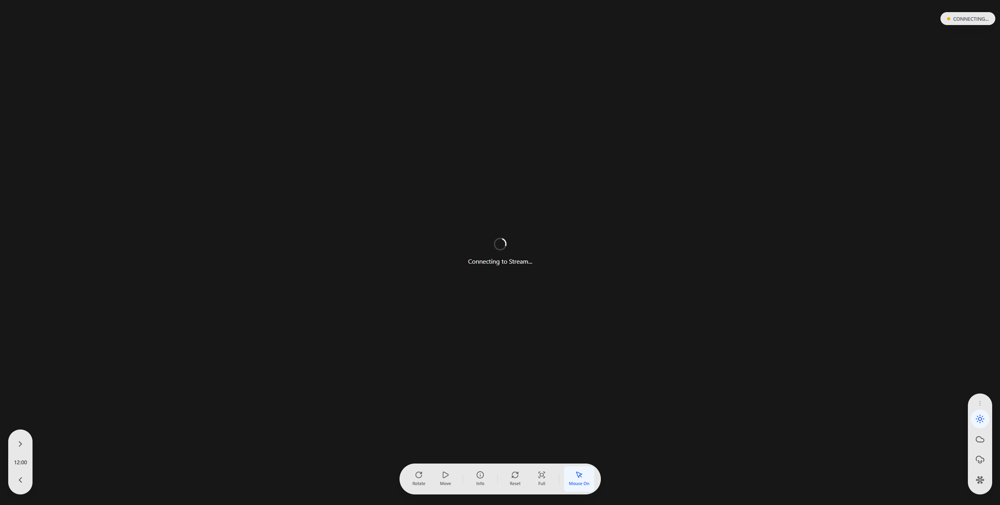
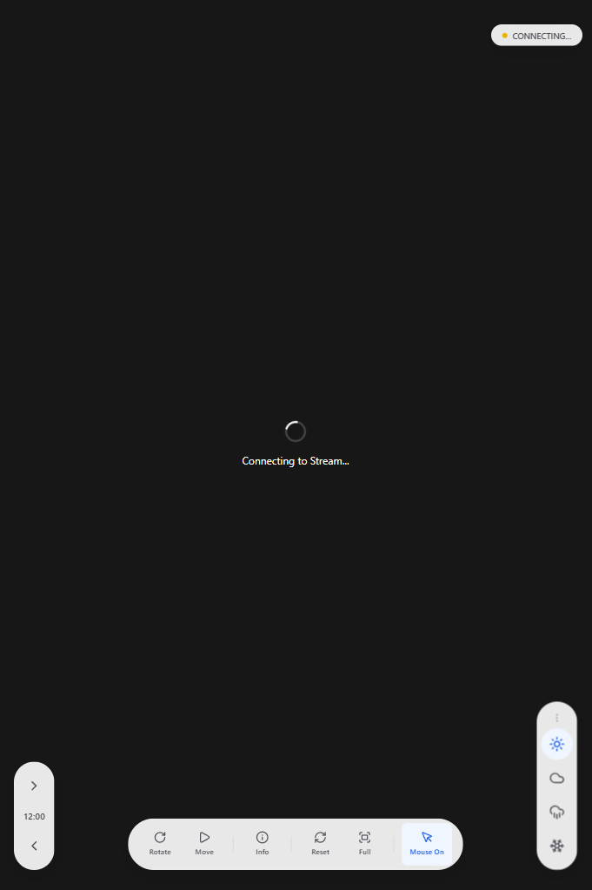
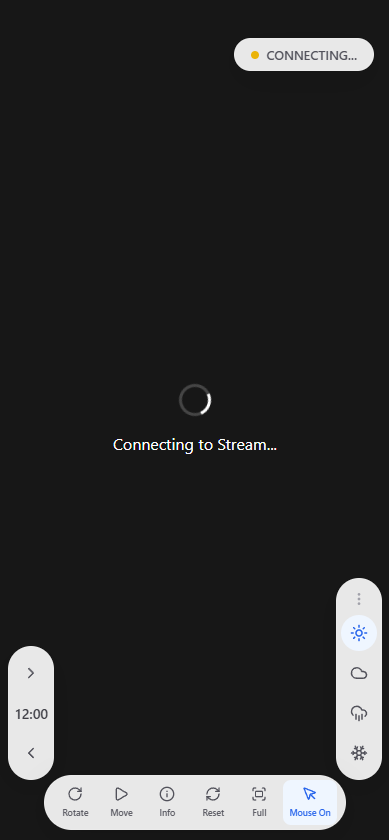
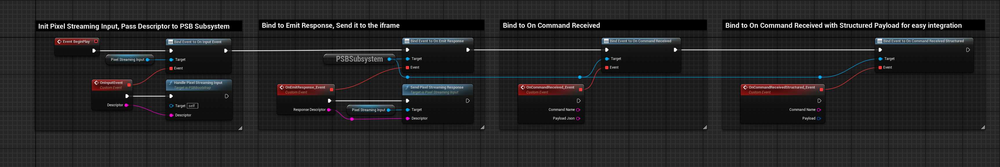
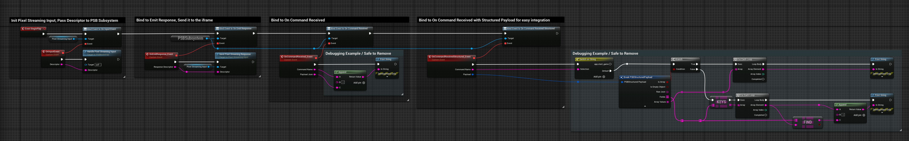
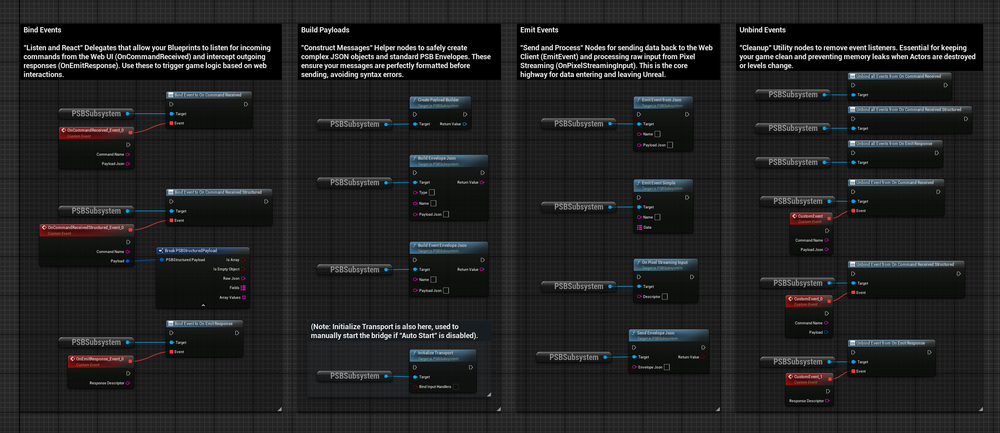
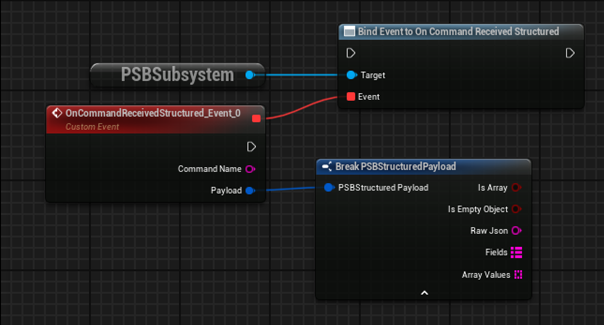
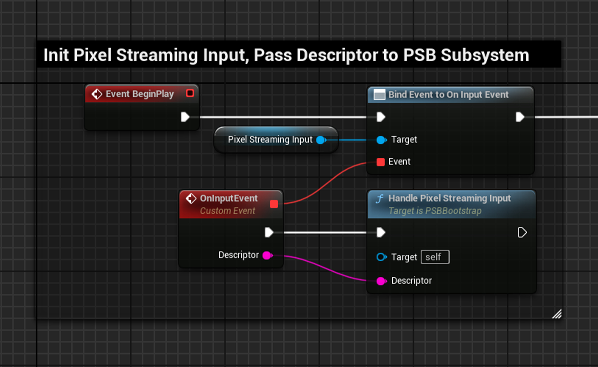
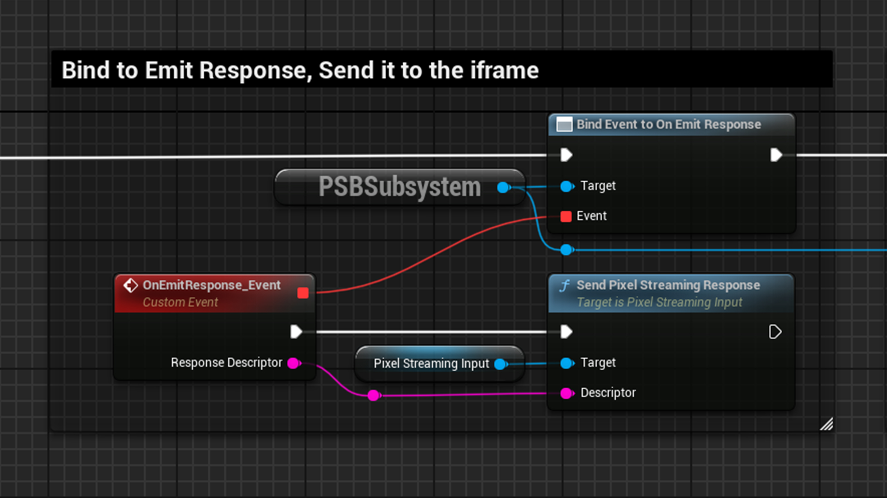

# Pixel Streaming Bridge (PSB) - User Guide

## Introduction
Pixel Streaming Bridge (PSB) is a robust, production-ready solution for integrating Unreal Engine Pixel Streaming with web applications. It provides a structured, JSON-based messaging protocol to enable seamless bidirectional communication between your Unreal Engine project and a web frontend.

## key Features
- **JSON Messaging**: Structured, type-safe communication using standard JSON envelopes.
- **Provider Agnostic**: Works with Epic's reference Cirrus server or scalable cloud providers (Arcware, Eagle 3D, etc.).
- **Blueprint & C++ Support**: Easy-to-use Blueprint nodes and a flexible C++ subsystem.
- **Modern Web UI**: A production-ready Next.js React template (`psb-ui`) included.
- **Iframe Optimized**: Designed to work reliably when embedding Pixel Streaming in iframes.

### Responsive UI Design

The included web template is fully responsive, ensuring your application looks great on any device:

| Desktop | Tablet | Mobile |
|---------|--------|--------|
|  |  |  |


## Getting Started

### 1. Installation
1.  **Unreal Engine**:
    *   Copy the `PSB` folder to your project's `Plugins` directory.
    *   Enable the plugin in **Edit > Plugins**.
    *   Restart the Editor.
2.  **Web UI** (Optional but Recommended):
    *   Navigate to `psb-ui/templates/basic`.
    *   Run `npm install` and `npm run dev` to start the local development server.

### 2. Basic Setup (Blueprint)
1.  **Enable Input**: Add a **PixelStreamingInput** component to your PlayerController or Pawn.
2.  **Receive Commands**:
    *   Get the **PSBSubsystem** (Game Instance Subsystem).
    *   Bind to **OnCommandReceived**.
    *   Check `CommandName` (e.g., "app.start_game") and handle the logic.
3.  **Send Events**:
    *   Use the **Emit Event from Json** node.
    *   Specify the `Name` (e.g., "game.score_updated") and `PayloadJson` (e.g., `{"score": 100}`).



*Figure: Example of binding to the PSB Subsystem.*



*Figure: Complete bootstrap and debug graph.*

### 3. Basic Setup (Web)
Using the provided `@psb-ui` library:

```typescript
import { usePSB } from '@psb-ui/provider';

function MyComponent() {
  const { sendCommand } = usePSB();

  const handleCreate = () => {
    // Sends: { type: "command", name: "app.spawn_object", payload: { "id": "cube" } }
    sendCommand('app.spawn_object', { id: 'cube' });
  };

  return <button onClick={handleCreate}>Spawn Cube</button>;
}
```

## Advanced Usage

### Handling Responses
PSB supports a request-response pattern. When you send a command from the web, you can await a response from Unreal.

**Unreal Side:**
Bind to **OnEmitResponse** in your main Blueprint logic (e.g., in your GameInstance or a specialized Manager Actor). When processed, call **Send Pixel Streaming Response** with the response data.

### Custom Payloads
For complex data, you can use the `UPSBPayloadBuilder` in C++ or standard JSON string manipulation in Blueprints.

## Troubleshooting

*   **No Video?** Check that your Signalling Server is running and Unreal is connected (check Output Log).
*   **Commands not working?** Ensure `PixelStreamingInput` is active and capturing input.
*   **"Waiting for Streamer"?** Verify the stream URL in the web client configuration.

---

For technical details, see [FAB_PRODUCT_DOCS.md](./FAB_PRODUCT_DOCS.md).

---

## Blueprint API Reference

This section details the core Blueprint nodes available in the PSB plugin.



### 1. OnCommandReceived
**Description**: Fired when a JSON command is received from the Web UI.
**Usage**: Bind to this event in your `GameInstance` or `Manager` actor to handle incoming logic.



### 2. OnPixelStreamingInput
**Description**: Helper to process raw input from the Pixel Streaming component.
**Usage**: Connect this to the standard `OnInputEvent` from the PixelStreamingInputComponent.



### 3. EmitEventFromJson
**Description**: Sends a JSON event to the Web UI.
**Inputs**:
*   `Name` (String): The event name (e.g. `game.score`).
*   `PayloadJson` (String): The data payload.


### 4. OnEmitResponse
**Description**: Helper event that provides the "Response Descriptor" needed by the standard `Send Pixel Streaming Response` node.
**Usage**: Use this to route PSB messages back through the standard Pixel Streaming response channel.




